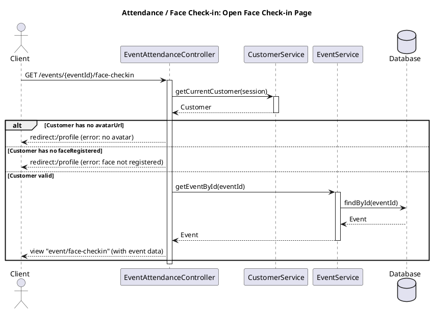
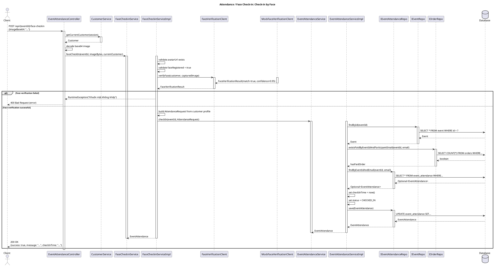
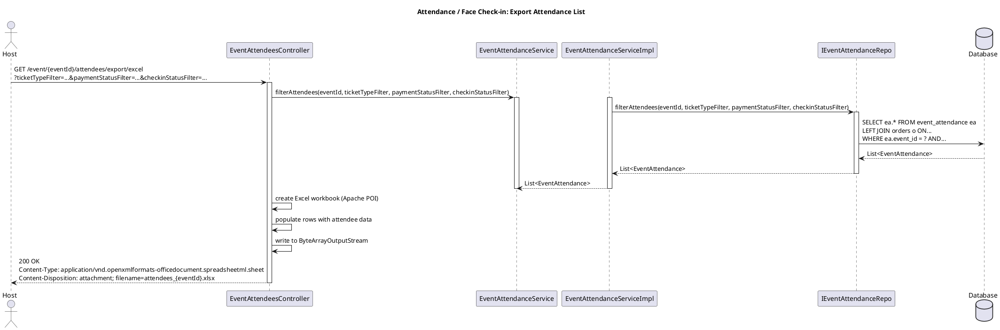
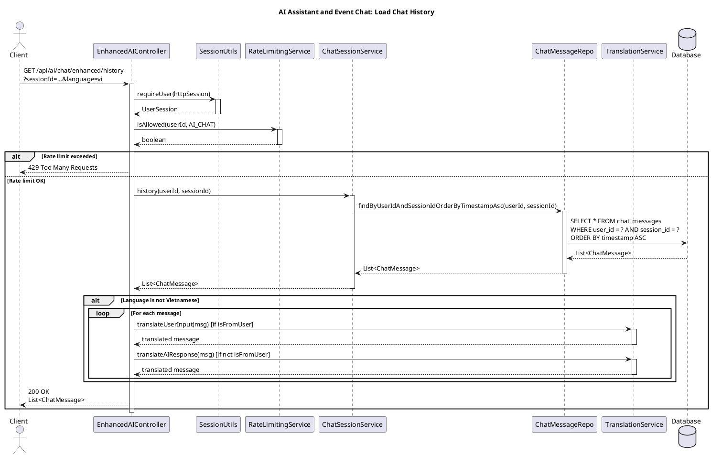
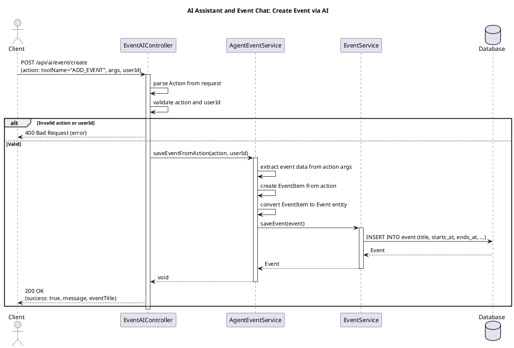
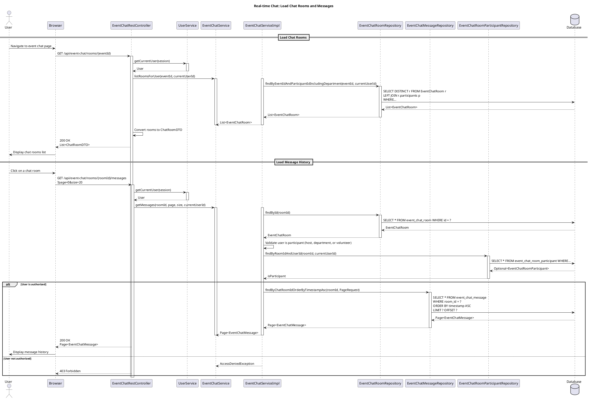
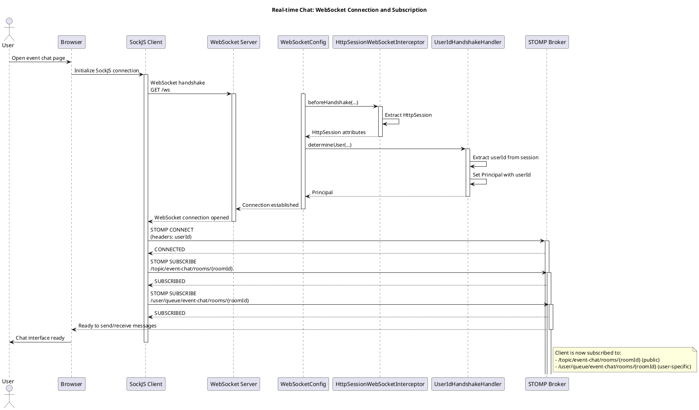

```plantuml
@startuml
' Attendance / Face Check-in Module – Class Diagram

package "com.group02.openevent.controller.attendance" {
    class EventAttendanceController {
        - EventService eventService
        - EventAttendanceService attendanceService
        - FaceCheckinService faceCheckinService
        - CustomerService customerService
        - UserService userService
        + showCheckinForm(eventId, model) : String
        + processCheckin(eventId, request, redirectAttributes) : String
        + processCheckout(eventId, email, redirectAttributes) : String
        + showFaceCheckinPage(eventId, model, session, redirectAttributes) : String
        + processFaceCheckin(eventId, requestBody, session) : ResponseEntity<?>
        + getAttendances(eventId) : ResponseEntity<List<EventAttendance>>
        + getAttendanceStats(eventId) : ResponseEntity<AttendanceStatsDTO>
        + manageAttendance(eventId, model) : String
    }
    
    class EventAttendeesController {
        - EventService eventService
        - EventAttendanceService attendanceService
        + checkIn(eventId, attendeeId) : ResponseEntity<?>
        + checkOut(eventId, attendeeId) : ResponseEntity<?>
        + addAttendee(...) : ResponseEntity<?>
        + editAttendee(...) : ResponseEntity<?>
        + deleteAttendee(eventId, attendeeId) : ResponseEntity<?>
        + exportToExcel(...) : ResponseEntity<byte[]>
    }
}

package "com.group02.openevent.service" {
    interface EventAttendanceService {
        + checkIn(eventId, request) : EventAttendance
        + checkOut(eventId, email) : EventAttendance
        + getAttendancesByEventId(eventId) : List<EventAttendance>
        + getAttendanceStats(eventId) : AttendanceStatsDTO
        + listCheckIn(eventId, attendanceId) : EventAttendance
        + addAttendee(...) : EventAttendance
        + updateAttendee(...) : EventAttendance
        + deleteAttendee(eventId, attendanceId) : void
        + filterAttendees(...) : Page<EventAttendance>
        + createAttendanceFromOrder(order) : EventAttendance
    }
    
    interface FaceCheckinService {
        + faceCheckIn(eventId, capturedImage, currentCustomer) : EventAttendance
    }
    
    interface FaceVerificationClient {
        + verifyFace(customer, capturedImage) : FaceVerificationResult
    }
}

package "com.group02.openevent.service.impl" {
    class EventAttendanceServiceImpl {
        - IEventAttendanceRepo attendanceRepo
        - IEventRepo eventRepo
        - IOrderRepo orderRepo
        - ITicketTypeRepo ticketTypeRepository
        - ICustomerRepo customerRepo
        - IAccountRepo accountRepo
        + checkIn(eventId, request) : EventAttendance
        + checkOut(eventId, email) : EventAttendance
        + getAttendancesByEventId(eventId) : List<EventAttendance>
        + getAttendanceStats(eventId) : AttendanceStatsDTO
        + listCheckIn(eventId, attendanceId) : EventAttendance
        + addAttendee(...) : EventAttendance
        + updateAttendee(...) : EventAttendance
        + deleteAttendee(eventId, attendanceId) : void
        + filterAttendees(...) : Page<EventAttendance>
        + createAttendanceFromOrder(order) : EventAttendance
    }
    
    class FaceCheckinServiceImpl {
        - FaceVerificationClient faceVerificationClient
        - EventAttendanceService attendanceService
        + faceCheckIn(eventId, capturedImage, currentCustomer) : EventAttendance
    }
    
    class MockFaceVerificationClient {
        + verifyFace(customer, capturedImage) : FaceVerificationResult
    }
}

package "com.group02.openevent.repository" {
    interface IEventAttendanceRepo {
        + findByEventIdAndEmail(eventId, email) : Optional<EventAttendance>
        + findByEventId(eventId) : List<EventAttendance>
        + findByOrder_OrderId(orderId) : Optional<EventAttendance>
        + countCheckedInByEventId(eventId) : long
        + countCheckedOutByEventId(eventId) : long
        + countCurrentlyPresentByEventId(eventId) : long
        + countByEventId(eventId) : long
        + existsByEventIdAndEmailAndCheckedIn(eventId, email) : boolean
        + filterAttendees(...) : Page<EventAttendance>
        + findByEvent_IdAndAttendanceId(eventId, attendanceId) : Optional<EventAttendance>
    }
}

package "com.group02.openevent.model.attendance" {
    class EventAttendance {
        - Long attendanceId
        - Order order
        - Event event
        - Customer customer
        - String fullName
        - String email
        - String phone
        - String organization
        - LocalDateTime checkInTime
        - LocalDateTime checkOutTime
        - AttendanceStatus status
        - LocalDateTime createdAt
        - LocalDateTime updatedAt
        - String notes
        + onUpdate() : void
    }
    
    enum AttendanceStatus {
        PENDING
        CHECKED_IN
        CHECKED_OUT
    }
}

package "com.group02.openevent.dto.attendance" {
    class AttendanceRequest {
        - String fullName
        - String email
        - String phone
        - String organization
    }
    
    class AttendanceStatsDTO {
        - Long eventId
        - String eventTitle
        - long totalCheckedIn
        - long totalCheckedOut
        - long currentlyPresent
        - long totalAttendees
    }
}

package "com.group02.openevent.dto.face" {
    class FaceVerificationResult {
        - boolean match
        - double confidence
        - String message
        + success(confidence) : FaceVerificationResult
        + failure(message) : FaceVerificationResult
    }
}

' Relationships
EventAttendanceController --> EventAttendanceService
EventAttendanceController --> FaceCheckinService
EventAttendeesController --> EventAttendanceService

EventAttendanceServiceImpl ..|> EventAttendanceService
EventAttendanceServiceImpl --> IEventAttendanceRepo
EventAttendanceServiceImpl --> IEventRepo
EventAttendanceServiceImpl --> IOrderRepo

FaceCheckinServiceImpl ..|> FaceCheckinService
FaceCheckinServiceImpl --> FaceVerificationClient
FaceCheckinServiceImpl --> EventAttendanceService

MockFaceVerificationClient ..|> FaceVerificationClient

IEventAttendanceRepo --> EventAttendance

EventAttendance --> Order : "many-to-one (nullable)"
EventAttendance --> Event : "many-to-one (required)"
EventAttendance --> Customer : "many-to-one (nullable)"

EventAttendanceController ..> AttendanceRequest : uses
EventAttendanceController ..> AttendanceStatsDTO : uses
FaceCheckinServiceImpl ..> FaceVerificationResult : uses
FaceCheckinServiceImpl ..> AttendanceRequest : uses

@enduml
```

```plantuml
@startuml
' AI Assistant & Event Chat Module – Class Diagram

package "com.group02.openevent.ai.controller" {
    class EnhancedAIController {
        - ChatSessionService chatSessionService
        - LanguageDetectionService languageDetectionService
        - TranslationService translationService
        - AISecurityService securityService
        - RateLimitingService rateLimitingService
        - SessionUtils sessionUtils
        + sessions(language, httpSession) : ResponseEntity<List<SessionItem>>
        + createSession(req, language, httpSession) : ResponseEntity<NewSessionRes>
        + history(sessionId, language, httpSession) : ResponseEntity<List<ChatMessage>>
        + chat(req, language, httpSession) : ResponseEntity<ChatReply>
        + detectLanguage(request, httpSession) : ResponseEntity<Map<String, Object>>
        + translate(request, httpSession) : ResponseEntity<Map<String, Object>>
        + getRateLimitInfo(httpSession) : ResponseEntity<Map<String, Object>>
        + getSupportedLanguages() : ResponseEntity<List<Map<String, String>>>
        + health() : ResponseEntity<Map<String, Object>>
    }
    
    class EventAIController {
        - AgentEventService agentEventService
        - EventService eventService
        - PlaceService placeService
        - ObjectMapper objectMapper
        + createEvent(request) : ResponseEntity<Map<String, Object>>
        + updateEvent(action) : ResponseEntity<Map<String, Object>>
        + deleteEvent(action) : ResponseEntity<Map<String, Object>>
        + getFreeTime(request) : ResponseEntity<Map<String, Object>>
        + checkTimeConflict(request) : ResponseEntity<Map<String, Object>>
        + getEventStats() : ResponseEntity<Map<String, Object>>
    }
}

package "com.group02.openevent.services.ai" {
    class ChatSessionService {
        - ChatSessionRepo chatSessionRepo
        - ChatMessageRepo chatMessageRepo
        + list(userId) : List<SessionItem>
        + create(userId, title) : NewSessionRes
        + history(userId, sessionId) : List<ChatMessage>
        + chat(request) : ChatReply
        - generateAIResponse(userMessage, userId, sessionId) : String
        - convertToSessionItem(session) : SessionItem
    }
}

package "com.group02.openevent.ai.service" {
    class EventAIAgent {
        - LLM llm
        - EmbeddingService embeddingService
        - QdrantService qdrantService
        - PlaceService placeService
        - EventService eventService
        - AgentEventService agentEventService
        - VectorIntentClassifier classifier
        - WeatherService weatherService
        - EventVectorSearchService eventVectorSearchService
        - OrderAIService orderAIService
        - ICustomerRepo customerRepo
        - TicketTypeService ticketTypeService
        - AIEventMapper AIEventMapper
        - ChatMessageRepo chatMessageRepo
        - LanguageDetectionService languageDetectionService
        - TranslationService translationService
        - AISecurityService securityService
        - Map<String, PendingEvent> pendingEvents
        + reply(userInput, userId, sessionId) : String
        + getGreeting(sessionId, userId) : String
        + shouldEndConversation(userInput) : boolean
        + getConversationSummary(sessionId, userId) : String
        + getCurrentEvent(userId) : List<Event>
        + processUserInput(userInput, userId, sessionId, context, response) : String
        - buildSystemPrompt() : String
        - buildConversationContext(sessionId, userId) : List<Message>
        - handleSummaryRequest(userInputs, userId) : String
        - handleTicketInfoQuery(userInput, userVector) : String
        - isOutOfScope(userInput) : boolean
        - handleOutOfScopeQuestion() : String
        - isWeatherQuestion(userInput) : boolean
        - handleWeatherQuestion(userInput) : String
        - extractEventName(userInput) : String
        - extractParticipantInfo(userInput) : Map<String, String>
        + tryParseActions(jsonPart) : List<Action>
    }
    
    class EmbeddingService {
        - String apiToken
        - String apiUrl
        - String modelId
        - boolean isEnabled
        - HttpClient httpClient
        - ObjectMapper mapper
        + getEmbedding(input) : float[]
        + getEmbeddings(texts) : List<float[]>
        + cosineSimilarity(a, b) : double
    }
}

package "com.group02.openevent.ai.qdrant.service" {
    class QdrantService {
        - String baseUrl
        - String apiKey
        - String collection
        - int vectorSize
        - HttpClient http
        - ObjectMapper om
        + initializeIndexes() : void
        + ensureCollection() : void
        + upsertEmbedding(id, embedding, payload) : String
        + upsertPoints(points) : void
        + deleteEmbedding(pointId) : void
        + searchSimilarVectors(queryVector, limit) : List<Map<String, Object>>
        + searchSimilarVectorsWithFilter(queryVector, limit, filter) : List<Map<String, Object>>
        + searchPlacesByVector(queryVector, limit) : List<Map<String, Object>>
        + createPayloadIndex(fieldName, fieldType) : void
    }
    
    class VectorIntentClassifier {
        - Map<String, float[]> ticketInfoExampleVectors
        - QdrantService qdrantService
        - EmbeddingService embeddingService
        - EventVectorSearchService eventVectorSearchService
        + initializeExampleVectors() : void
        + classifyIntent(userInput, userVector) : ActionType
        + classifyConfirmIntent(userInput, userVector) : ActionType
        + classifyWeather(userInput, userVector) : String
        + classifyEventTitle(userInput, userVector) : String
        + extractEventName(userInput) : String
        + extractEventNameWithEmbedding(userInput) : String
        + extractEventNameWithRegex(userInput) : String
        + isTicketInfoQuery(userInput, userVector) : boolean
    }
}

package "com.group02.openevent.repository.ai" {
    interface ChatMessageRepo {
        + findByUserIdAndSessionIdOrderByTimestampAsc(userId, sessionId) : List<ChatMessage>
        + findByUserIdOrderByTimestampAsc(userId) : List<ChatMessage>
        + findDistinctSessionIdsByUserId(userId) : List<Long>
        + countByUserIdAndSessionId(userId, sessionId) : Long
        + deleteByUserIdAndSessionId(userId, sessionId) : void
        + deleteByUserId(userId) : void
    }
    
    interface ChatSessionRepo {
        + findByUserIdOrderByCreatedAtDesc(userId) : List<ChatSession>
        + findByUserIdAndSessionId(userId, sessionId) : ChatSession
        + deleteByUserId(userId) : void
    }
}

package "com.group02.openevent.models.ai" {
    class ChatMessage {
        - Long messageId
        - String sessionId
        - Long userId
        - String message
        - Boolean isFromUser
        - LocalDateTime timestamp
        - LocalDateTime createdAt
    }
    
    class ChatSession {
        - String sessionId
        - Long userId
        - String title
        - LocalDateTime createdAt
        - LocalDateTime updatedAt
        + onUpdate() : void
    }
}

package "com.group02.openevent.dto.ai" {
    class ChatRequest {
        + String message
        + Long userId
        + String sessionId
    }
    
    class ChatReply {
        + String message
        + boolean shouldReload
        + LocalDateTime timestamp
    }
    
    class SessionItem {
        + String sessionId
        + String title
        + LocalDateTime createdAt
        + LocalDateTime updatedAt
    }
    
    class NewSessionReq {
        + String title
    }
    
    class NewSessionRes {
        + String sessionId
        + String title
    }
}

' Relationships
EnhancedAIController --> ChatSessionService
EnhancedAIController --> LanguageDetectionService
EnhancedAIController --> TranslationService
EnhancedAIController --> AISecurityService
EnhancedAIController --> RateLimitingService

EventAIController --> AgentEventService
EventAIController --> EventService
EventAIController --> PlaceService

ChatSessionService --> ChatSessionRepo
ChatSessionService --> ChatMessageRepo
ChatSessionService ..> EventAIAgent : uses via SessionManager

EventAIAgent --> LLM : "external LLM client"
EventAIAgent --> EmbeddingService
EventAIAgent --> QdrantService
EventAIAgent --> PlaceService
EventAIAgent --> EventService
EventAIAgent --> AgentEventService
EventAIAgent --> VectorIntentClassifier
EventAIAgent --> WeatherService
EventAIAgent --> EventVectorSearchService
EventAIAgent --> OrderAIService
EventAIAgent --> ChatMessageRepo
EventAIAgent --> LanguageDetectionService
EventAIAgent --> TranslationService
EventAIAgent --> AISecurityService

VectorIntentClassifier --> QdrantService
VectorIntentClassifier --> EmbeddingService
VectorIntentClassifier --> EventVectorSearchService

EmbeddingService ..> "HuggingFace API" : "HTTP calls"
QdrantService ..> "Qdrant Vector DB" : "HTTP calls"

ChatMessageRepo --> ChatMessage
ChatSessionRepo --> ChatSession

ChatMessage --> ChatSession : "many-to-one (via sessionId)"
ChatMessage --> User : "many-to-one (via userId)"
ChatSession --> User : "many-to-one (via userId)"

EnhancedAIController ..> ChatRequest : uses
EnhancedAIController ..> ChatReply : uses
EnhancedAIController ..> SessionItem : uses
ChatSessionService ..> ChatRequest : uses
ChatSessionService ..> ChatReply : uses
ChatSessionService ..> SessionItem : uses
ChatSessionService ..> NewSessionRes : uses

@enduml
```

# Software Design Specification (SDS)
## Class Diagrams and Class Specifications

### Module A: Attendance / Face Check-in Module

---

## STEP 1 - Classes by Layer

### Controllers
- `EventAttendanceController` - Main controller for face-based attendance operations
- `EventAttendeesController` - Controller for managing attendees list (used for listing/export)

### Services
- `EventAttendanceService` (interface)
- `EventAttendanceServiceImpl` - Implementation of attendance service
- `FaceCheckinService` (interface)
- `FaceCheckinServiceImpl` - Implementation of face-based check-in
- `FaceVerificationClient` (interface) - Interface for face verification
- `MockFaceVerificationClient` - Mock implementation of face verification

### Repositories
- `IEventAttendanceRepo` - JPA repository for EventAttendance entity

### Entities
- `EventAttendance` - Main entity representing attendance record

### DTOs
- `AttendanceRequest` - DTO for check-in requests
- `AttendanceStatsDTO` - DTO for attendance statistics
- `FaceVerificationResult` - DTO for face verification results

---

## STEP 2 - Class Specifications

### [Module A] – Class Specification

#### EventAttendance (`com.group02.openevent.model.attendance.EventAttendance`)

| Item        | Description |
|------------|-------------|
| Layer / Role | Entity |
| Responsibility | Represents an attendance record for an event. Tracks check-in/check-out times, participant information, and links to Order, Event, and Customer entities. |

**Fields**

| Field | Type | Description |
|-------|------|-------------|
| `attendanceId` | Long | Primary key, unique identifier for attendance record |
| `order` | Order | Many-to-one relationship with Order (nullable, for attendees with paid tickets) |
| `event` | Event | Many-to-one relationship with Event (required) |
| `customer` | Customer | Many-to-one relationship with Customer (nullable) |
| `fullName` | String | Participant's full name (required, max 200 chars) |
| `email` | String | Participant's email (max 200 chars, used for unique constraint per event) |
| `phone` | String | Participant's phone number (max 50 chars) |
| `organization` | String | Participant's organization (max 200 chars) |
| `checkInTime` | LocalDateTime | Timestamp when participant checked in |
| `checkOutTime` | LocalDateTime | Timestamp when participant checked out |
| `status` | AttendanceStatus (enum) | Current status: PENDING, CHECKED_IN, CHECKED_OUT |
| `createdAt` | LocalDateTime | Record creation timestamp |
| `updatedAt` | LocalDateTime | Last update timestamp |
| `notes` | String | Additional notes about the attendance |

**Methods**

| Method | Return type | Description | Calls / Dependencies |
|--------|-------------|-------------|----------------------|
| `onUpdate()` | void | JPA lifecycle callback, updates `updatedAt` timestamp | Called automatically by JPA |

---

#### EventAttendanceService (`com.group02.openevent.service.EventAttendanceService`)

| Item        | Description |
|------------|-------------|
| Layer / Role | Service Interface |
| Responsibility | Defines business logic interface for attendance operations including face-based check-in, check-out, statistics, and attendee management. |

**Methods**

| Method | Return type | Description | Calls / Dependencies |
|--------|-------------|-------------|----------------------|
| `checkIn(Long eventId, AttendanceRequest request)` | EventAttendance | Process check-in for an event. Validates ticket ownership, finds existing attendance record, updates check-in time and status. | Calls IEventAttendanceRepo, IEventRepo, IOrderRepo |
| `checkOut(Long eventId, String email)` | EventAttendance | Process check-out for an event. Validates check-in status, updates check-out time and status. | Calls IEventAttendanceRepo, IOrderRepo |
| `getAttendancesByEventId(Long eventId)` | List<EventAttendance> | Get all attendance records for an event | Calls IEventAttendanceRepo |
| `getAttendanceByEventAndEmail(Long eventId, String email)` | Optional<EventAttendance> | Find attendance by event and email | Calls IEventAttendanceRepo |
| `getAttendanceStats(Long eventId)` | AttendanceStatsDTO | Calculate attendance statistics (total checked in, checked out, currently present, total attendees) | Calls IEventAttendanceRepo, IEventRepo |
| `isAlreadyCheckedIn(Long eventId, String email)` | boolean | Check if email already checked in for event | Calls IEventAttendanceRepo |
| `listCheckIn(Long eventId, Long attendanceId)` | EventAttendance | Check-in attendee from list (by attendance ID) | Calls IEventAttendanceRepo |
| `checkOut(Long eventId, Long attendanceId)` | EventAttendance | Check-out attendee from list (by attendance ID) | Calls IEventAttendanceRepo |
| `addAttendee(Long eventId, String name, String email, String phone, Long ticketTypeId, String organization)` | EventAttendance | Add attendee manually (without Order, for walk-ins) | Calls IEventRepo, ITicketTypeRepo, IEventAttendanceRepo |
| `updateAttendee(Long eventId, Long attendanceId, String name, String email, String phone, String organization)` | EventAttendance | Update attendee information | Calls IEventAttendanceRepo |
| `deleteAttendee(Long eventId, Long attendanceId)` | void | Delete attendee record and associated order if exists | Calls IEventAttendanceRepo, IOrderRepo |
| `filterAttendees(Long eventId, Long ticketTypeFilter, String paymentStatusFilter, String checkinStatusFilter, Pageable pageable)` | Page<EventAttendance> | Filter attendees with pagination | Calls IEventAttendanceRepo |
| `filterAttendees(Long eventId, Long ticketTypeFilter, String paymentStatusFilter, String checkinStatusFilter)` | List<EventAttendance> | Filter attendees without pagination | Calls IEventAttendanceRepo |
| `createAttendanceFromOrder(Order order)` | EventAttendance | Create EventAttendance automatically when order is paid | Calls IEventAttendanceRepo, validates Order status |

---

#### EventAttendanceServiceImpl (`com.group02.openevent.service.impl.EventAttendanceServiceImpl`)

| Item        | Description |
|------------|-------------|
| Layer / Role | Service Implementation |
| Responsibility | Implements attendance business logic. Handles face-based check-in/check-out validation, ticket ownership verification, and attendee management. |

**Methods**

| Method | Return type | Description | Calls / Dependencies |
|--------|-------------|-------------|----------------------|
| All methods from `EventAttendanceService` interface | (see interface) | Implements all interface methods with transaction management | Calls IEventAttendanceRepo, IEventRepo, IOrderRepo, ITicketTypeRepo, ICustomerRepo, IAccountRepo |

---

#### EventAttendanceController (`com.group02.openevent.controller.attendance.EventAttendanceController`)

| Item        | Description |
|------------|-------------|
| Layer / Role | Controller |
| Responsibility | Handles HTTP requests for face-based attendance operations. Provides web pages and API endpoints for face check-in, attendance management, and statistics. |

**Methods**

| Method | Return type | Description | Calls / Dependencies |
|--------|-------------|-------------|----------------------|
| `showCheckinForm(Long eventId, Model model)` | String | Display check-in form page | Calls EventService, returns view "event/checkin-form" |
| `processCheckin(Long eventId, AttendanceRequest request, RedirectAttributes redirectAttributes)` | String | Process check-in form submission | Calls EventAttendanceService, redirects to check-in form |
| `showCheckoutForm(Long eventId, Model model)` | String | Display check-out form page | Calls EventService, returns view "event/checkout-form" |
| `processCheckout(Long eventId, String email, RedirectAttributes redirectAttributes)` | String | Process check-out form submission | Calls EventAttendanceService, redirects to checkout form |
| `getAttendances(Long eventId)` | ResponseEntity<List<EventAttendance>> | API: Get all attendances for an event | Calls EventAttendanceService |
| `getAttendanceStats(Long eventId)` | ResponseEntity<AttendanceStatsDTO> | API: Get attendance statistics | Calls EventAttendanceService |
| `manageAttendance(Long eventId, Model model)` | String | Host dashboard: View all attendances with statistics | Calls EventService, EventAttendanceService, returns view "host/manage-attendance" |
| `showFaceCheckinPage(Long eventId, Model model, HttpSession session, RedirectAttributes redirectAttributes)` | String | Display face check-in page (requires avatar and face registration) | Calls CustomerService, EventService, validates customer has avatarUrl and faceRegistered |
| `processFaceCheckin(Long eventId, Map<String, String> requestBody, HttpSession session)` | ResponseEntity<?> | API: Process face-based check-in with base64 image | Calls CustomerService, FaceCheckinService |

---

#### EventAttendeesController (`com.group02.openevent.controller.attendance.EventAttendeesController`)

| Item        | Description |
|------------|-------------|
| Layer / Role | Controller |
| Responsibility | Handles REST API endpoints for attendee management operations (check-in, check-out, add, update, delete, export). Used for listing and managing attendees, including those checked in via face recognition. |

**Methods**

| Method | Return type | Description | Calls / Dependencies |
|--------|-------------|-------------|----------------------|
| `checkIn(Long eventId, Long attendeeId)` | ResponseEntity<?> | API: Check-in attendee by ID | Calls EventAttendanceService.listCheckIn() |
| `checkOut(Long eventId, Long attendeeId)` | ResponseEntity<?> | API: Check-out attendee by ID | Calls EventAttendanceService.checkOut() |
| `addAttendee(Long eventId, String name, String email, String phone, Long ticketTypeId, String organization)` | ResponseEntity<?> | API: Add new attendee manually | Calls EventAttendanceService.addAttendee() |
| `editAttendee(Long eventId, Long attendeeId, String name, String email, String phone, String organization)` | ResponseEntity<?> | API: Update attendee information | Calls EventAttendanceService.updateAttendee() |
| `deleteAttendee(Long eventId, Long attendeeId)` | ResponseEntity<?> | API: Delete attendee | Calls EventAttendanceService.deleteAttendee() |
| `exportToExcel(Long eventId, Long ticketTypeFilter, String paymentStatusFilter, String checkinStatusFilter)` | ResponseEntity<byte[]> | Export attendees list to Excel file | Calls EventAttendanceService.filterAttendees(), generates Excel using Apache POI |

---

#### FaceCheckinService (`com.group02.openevent.service.FaceCheckinService`)

| Item        | Description |
|------------|-------------|
| Layer / Role | Service Interface |
| Responsibility | Defines interface for face-based check-in functionality. |

**Methods**

| Method | Return type | Description | Calls / Dependencies |
|--------|-------------|-------------|----------------------|
| `faceCheckIn(Long eventId, byte[] capturedImage, Customer currentCustomer)` | EventAttendance | Process face-based check-in. Validates customer has avatar and face registered, verifies face match, then performs check-in. | Calls FaceVerificationClient, EventAttendanceService |

---

#### FaceCheckinServiceImpl (`com.group02.openevent.service.impl.FaceCheckinServiceImpl`)

| Item        | Description |
|------------|-------------|
| Layer / Role | Service Implementation |
| Responsibility | Implements face-based check-in. Validates customer prerequisites, performs face verification, and delegates to attendance service. |

**Methods**

| Method | Return type | Description | Calls / Dependencies |
|--------|-------------|-------------|----------------------|
| `faceCheckIn(Long eventId, byte[] capturedImage, Customer currentCustomer)` | EventAttendance | Validates customer has avatarUrl and faceRegistered=true, calls FaceVerificationClient to verify face, builds AttendanceRequest from customer profile, calls EventAttendanceService.checkIn() | Calls FaceVerificationClient.verifyFace(), EventAttendanceService.checkIn() |

---

---

#### FaceVerificationClient (`com.group02.openevent.service.FaceVerificationClient`)

| Item        | Description |
|------------|-------------|
| Layer / Role | Service Interface |
| Responsibility | Interface for face verification service. Can be implemented with various face recognition APIs (AWS Rekognition, Azure Face API, etc.). |

**Methods**

| Method | Return type | Description | Calls / Dependencies |
|--------|-------------|-------------|----------------------|
| `verifyFace(Customer customer, byte[] capturedImage)` | FaceVerificationResult | Verify if captured image matches customer's registered face (from avatarUrl) | External face recognition API (to be implemented) |

---

#### MockFaceVerificationClient (`com.group02.openevent.service.impl.MockFaceVerificationClient`)

| Item        | Description |
|------------|-------------|
| Layer / Role | Service Implementation (Mock) |
| Responsibility | Mock implementation for demo purposes. Always returns match=true with confidence=0.95. |

**Methods**

| Method | Return type | Description | Calls / Dependencies |
|--------|-------------|-------------|----------------------|
| `verifyFace(Customer customer, byte[] capturedImage)` | FaceVerificationResult | Mock implementation, always returns success with confidence 0.95 | None (mock) |

---

#### IEventAttendanceRepo (`com.group02.openevent.repository.IEventAttendanceRepo`)

| Item        | Description |
|------------|-------------|
| Layer / Role | Repository |
| Responsibility | JPA repository for EventAttendance entity. Provides query methods for finding, counting, and filtering attendance records. |

**Methods**

| Method | Return type | Description | Calls / Dependencies |
|--------|-------------|-------------|----------------------|
| `findByEventIdAndEmail(Long eventId, String email)` | Optional<EventAttendance> | Find attendance by event and email (unique constraint) | JPA query |
| `findByEventId(Long eventId)` | List<EventAttendance> | Find all attendances for an event | JPA query |
| `findByOrder_OrderId(Long orderId)` | Optional<EventAttendance> | Find attendance by order ID | JPA query |
| `countCheckedInByEventId(Long eventId)` | long | Count checked-in attendances for event | JPA @Query |
| `countCheckedOutByEventId(Long eventId)` | long | Count checked-out attendances for event | JPA @Query |
| `countCurrentlyPresentByEventId(Long eventId)` | long | Count currently present (checked-in but not checked-out) | JPA @Query |
| `countByEventId(Long eventId)` | long | Count total attendances for event | JPA count |
| `existsByEventIdAndEmailAndCheckedIn(Long eventId, String email)` | boolean | Check if email already checked in | JPA @Query |
| `filterAttendees(Long eventId, Long ticketTypeId, String paymentStatus, String checkinStatus, Pageable pageable)` | Page<EventAttendance> | Filter attendees with pagination | JPA @Query with LEFT JOIN FETCH |
| `filterAttendees(Long eventId, Long ticketTypeId, String paymentStatus, String checkinStatus)` | List<EventAttendance> | Filter attendees without pagination | JPA @Query |
| `findByEvent_IdAndAttendanceId(Long eventId, Long attendanceId)` | Optional<EventAttendance> | Find attendance by event and attendance ID | JPA query |

---

#### AttendanceRequest (`com.group02.openevent.dto.attendance.AttendanceRequest`)

| Item        | Description |
|------------|-------------|
| Layer / Role | DTO |
| Responsibility | Data transfer object for face-based check-in requests. Contains participant information used during face verification and check-in process. |

**Fields**

| Field | Type | Description |
|-------|------|-------------|
| `fullName` | String | Participant's full name |
| `email` | String | Participant's email (used for validation) |
| `phone` | String | Participant's phone number |
| `organization` | String | Participant's organization (optional) |

---

#### AttendanceStatsDTO (`com.group02.openevent.dto.attendance.AttendanceStatsDTO`)

| Item        | Description |
|------------|-------------|
| Layer / Role | DTO |
| Responsibility | Data transfer object for attendance statistics. |

**Fields**

| Field | Type | Description |
|-------|------|-------------|
| `eventId` | Long | Event identifier |
| `eventTitle` | String | Event title |
| `totalCheckedIn` | long | Total number of checked-in attendees |
| `totalCheckedOut` | long | Total number of checked-out attendees |
| `currentlyPresent` | long | Number of attendees currently present (checked-in but not checked-out) |
| `totalAttendees` | long | Total number of registered attendees |

---

#### FaceVerificationResult (`com.group02.openevent.dto.face.FaceVerificationResult`)

| Item        | Description |
|------------|-------------|
| Layer / Role | DTO |
| Responsibility | Result of face verification process. Contains match status, confidence score, and optional message. |

**Fields**

| Field | Type | Description |
|-------|------|-------------|
| `match` | boolean | Whether the face matches (true/false) |
| `confidence` | double | Confidence score (0.0 - 1.0) |
| `message` | String | Optional message about the result |

**Methods**

| Method | Return type | Description | Calls / Dependencies |
|--------|-------------|-------------|----------------------|
| `success(double confidence)` | FaceVerificationResult | Static factory method for successful match | None |
| `failure(String message)` | FaceVerificationResult | Static factory method for failed match | None |

---

## STEP 3 - Relationships for Class Diagram

### Attendance / Face Check-in Module Relationships:

- **EventAttendance** has:
  - Many-to-One → **Order** (nullable)
  - Many-to-One → **Event** (required)
  - Many-to-One → **Customer** (nullable)

- **EventAttendanceController** depends on:
  - **EventService**
  - **EventAttendanceService**
  - **FaceCheckinService**
  - **CustomerService**
  - **UserService**

- **EventAttendeesController** depends on:
  - **EventService**
  - **EventAttendanceService**

- **EventAttendanceServiceImpl** depends on:
  - **IEventAttendanceRepo**
  - **IEventRepo**
  - **IOrderRepo**
  - **ITicketTypeRepo**
  - **ICustomerRepo**
  - **IAccountRepo**

- **FaceCheckinServiceImpl** depends on:
  - **FaceVerificationClient**
  - **EventAttendanceService**

- **FaceCheckinService** uses:
  - **FaceVerificationClient** (interface, implemented by MockFaceVerificationClient)

---

## STEP 4 - PlantUML Class Diagram



---

### Module B: AI Assistant & Event Chat Module

---

## STEP 1 - Classes by Layer

### Controllers
- `EventAIController` - REST API for AI event operations
- `EnhancedAIController` - Enhanced AI chat controller with multi-language support
- `ChatController` - Basic chat controller (if exists)

### Services
- `EventAIAgent` - Main AI agent service for processing user input
- `ChatSessionService` - Service for managing chat sessions and messages
- `EmbeddingService` - Service for generating text embeddings
- `QdrantService` - Service for vector database operations
- `VectorIntentClassifier` - Service for classifying user intent using vectors
- `EventVectorSearchService` - Service for vector-based event search
- `AgentEventService` - Service for AI agent event operations
- `OrderAIService` - Service for AI-powered order creation
- `LanguageDetectionService` - Service for detecting input language
- `TranslationService` - Service for translating text
- `AISecurityService` - Service for AI input/output security validation
- `RateLimitingService` - Service for rate limiting AI requests

### Repositories
- `ChatMessageRepo` - JPA repository for ChatMessage
- `ChatSessionRepo` - JPA repository for ChatSession

### Entities
- `ChatMessage` - Entity representing a chat message
- `ChatSession` - Entity representing a chat session

### DTOs
- `ChatRequest` - DTO for chat requests
- `ChatReply` - DTO for chat replies
- `SessionItem` - DTO for session list items
- `NewSessionReq` - DTO for creating new session
- `NewSessionRes` - DTO for new session response

---

## STEP 2 - Class Specifications

### [Module B] – Class Specification

#### ChatMessage (`com.group02.openevent.models.ai.ChatMessage`)

| Item        | Description |
|------------|-------------|
| Layer / Role | Entity |
| Responsibility | Represents a single chat message in a conversation session. Stores message content, sender (user or AI), timestamp, and links to session and user. |

**Fields**

| Field | Type | Description |
|-------|------|-------------|
| `messageId` | Long | Primary key, unique identifier for message |
| `sessionId` | String | Foreign key to ChatSession, identifies which conversation this message belongs to |
| `userId` | Long | Foreign key to User, identifies message owner |
| `message` | String | Message content (TEXT column) |
| `isFromUser` | Boolean | Flag indicating if message is from user (true) or AI assistant (false) |
| `timestamp` | LocalDateTime | Message timestamp |
| `createdAt` | LocalDateTime | Record creation timestamp |

---

#### ChatSession (`com.group02.openevent.models.ai.ChatSession`)

| Item        | Description |
|------------|-------------|
| Layer / Role | Entity |
| Responsibility | Represents a chat conversation session. Groups related messages together and tracks session metadata. |

**Fields**

| Field | Type | Description |
|-------|------|-------------|
| `sessionId` | String | Primary key, unique identifier for session |
| `userId` | Long | Foreign key to User, identifies session owner |
| `title` | String | Session title (max 255 chars) |
| `createdAt` | LocalDateTime | Session creation timestamp |
| `updatedAt` | LocalDateTime | Last update timestamp |

**Methods**

| Method | Return type | Description | Calls / Dependencies |
|--------|-------------|-------------|----------------------|
| `onUpdate()` | void | JPA lifecycle callback, updates `updatedAt` timestamp | Called automatically by JPA |

---

#### EventAIAgent (`com.group02.openevent.ai.service.EventAIAgent`)

| Item        | Description |
|------------|-------------|
| Layer / Role | Service |
| Responsibility | Main AI agent that processes user input, classifies intent, generates responses using LLM, and executes actions (create/update/delete events, buy tickets, set reminders). Handles conversation context, multi-session support, and integrates with vector search, embedding, and external services. |

**Fields**

| Field | Type | Description |
|-------|------|-------------|
| `llm` | LLM | Large Language Model client for generating responses |
| `embeddingService` | EmbeddingService | Service for generating text embeddings |
| `qdrantService` | QdrantService | Service for vector database operations |
| `placeService` | PlaceService | Service for place/location operations |
| `eventService` | EventService | Service for event operations |
| `agentEventService` | AgentEventService | Service for AI agent event operations |
| `classifier` | VectorIntentClassifier | Service for classifying user intent |
| `weatherService` | WeatherService | Service for weather information |
| `eventVectorSearchService` | EventVectorSearchService | Service for vector-based event search |
| `orderAIService` | OrderAIService | Service for AI-powered order creation |
| `customerRepo` | ICustomerRepo | Repository for customer data |
| `ticketTypeService` | TicketTypeService | Service for ticket type operations |
| `AIEventMapper` | AIEventMapper | Mapper for converting AI DTOs to Event entities |
| `chatMessageRepo` | ChatMessageRepo | Repository for chat messages |
| `languageDetectionService` | LanguageDetectionService | Service for detecting input language |
| `translationService` | TranslationService | Service for translating text |
| `securityService` | AISecurityService | Service for AI security validation |
| `pendingEvents` | Map<String, PendingEvent> | In-memory map of pending events by session ID |

**Methods**

| Method | Return type | Description | Calls / Dependencies |
|--------|-------------|-------------|----------------------|
| `reply(String userInput, Long userId, String sessionId)` | String | Main entry point: process user input with session context, build conversation context, call processUserInput | Calls buildConversationContext(), processUserInput() |
| `getGreeting(String sessionId, Long userId)` | String | Generate greeting message | Calls LLM.generateResponse() |
| `shouldEndConversation(String userInput)` | boolean | Check if user wants to end conversation | None (string matching) |
| `getConversationSummary(String sessionId, Long userId)` | String | Get summary of conversation | Calls buildConversationContext() |
| `getCurrentEvent(Long userId)` | List<Event> | Get current events for user | Calls EventService.getEventByUserId() |
| `processUserInput(String userInput, Long userId, String sessionId, List<Message> context, HttpServletResponse response)` | String | Core processing: validate input, classify intent, handle order flow, call LLM, parse actions (ADD_EVENT, UPDATE_EVENT, DELETE_EVENT, SET_REMINDER), execute actions | Calls EmbeddingService.getEmbedding(), VectorIntentClassifier.classifyIntent(), OrderAIService, LLM.generateResponse(), AgentEventService, EventService, PlaceService, WeatherService, QdrantService |
| `buildSystemPrompt()` | String | Build system prompt for LLM with instructions | None (string building) |
| `buildConversationContext(String sessionId, Long userId)` | List<Message> | Build conversation context from system prompt and recent messages | Calls ChatMessageRepo.findByUserIdAndSessionIdOrderByTimestampAsc() |
| `handleSummaryRequest(String userInputs, Long userId)` | String | Handle time-based summary requests (today, tomorrow, this week, etc.) | Calls EventService.getAllEvents() |
| `handleTicketInfoQuery(String userInput, float[] userVector)` | String | Handle queries about ticket information | Calls EventVectorSearchService.searchEvents(), TicketTypeService.getTicketTypesByEventId() |
| `isOutOfScope(String userInput)` | boolean | Check if question is outside OpenEvent scope | None (keyword matching) |
| `handleOutOfScopeQuestion()` | String | Generate response for out-of-scope questions | None |
| `isWeatherQuestion(String userInput)` | boolean | Check if question is about weather | None (keyword matching) |
| `handleWeatherQuestion(String userInput)` | String | Handle weather-related questions | Calls WeatherService.getForecastNote() |
| `extractEventName(String userInput)` | String | Extract event name from user input | None (string manipulation) |
| `extractParticipantInfo(String userInput)` | Map<String, String> | Extract participant info (name, email, phone, organization) from user input | None (regex patterns) |
| `tryParseActions(String jsonPart)` | List<Action> | Parse JSON action array from LLM response | Uses ObjectMapper |

---

#### ChatSessionService (`com.group02.openevent.services.ai.ChatSessionService`)

| Item        | Description |
|------------|-------------|
| Layer / Role | Service |
| Responsibility | Manages chat sessions and messages. Handles session creation, message storage, and delegates AI response generation to EventAIAgent. |

**Methods**

| Method | Return type | Description | Calls / Dependencies |
|--------|-------------|-------------|----------------------|
| `list(Long userId)` | List<SessionItem> | List all sessions for a user, ordered by creation date descending | Calls ChatSessionRepo.findByUserIdOrderByCreatedAtDesc() |
| `create(Long userId, String title)` | NewSessionRes | Create a new chat session | Calls ChatSessionRepo.save() |
| `history(Long userId, String sessionId)` | List<ChatMessage> | Get chat history for a session | Calls ChatMessageRepo.findByUserIdAndSessionIdOrderByTimestampAsc() |
| `chat(ChatRequest request)` | ChatReply | Process chat message: save user message, generate AI response, save AI response | Calls ChatMessageRepo.save(), generateAIResponse(), EventAIAgent.reply() |
| `generateAIResponse(String userMessage, Long userId, String sessionId)` | String | Generate AI response using EventAIAgent | Calls SessionManager.getOrCreate(), EventAIAgent.reply() |
| `convertToSessionItem(ChatSession session)` | SessionItem | Convert ChatSession entity to SessionItem DTO | None |

---

#### EmbeddingService (`com.group02.openevent.ai.service.EmbeddingService`)

| Item        | Description |
|------------|-------------|
| Layer / Role | Service |
| Responsibility | Generates text embeddings using HuggingFace API. Converts text to vector representations for semantic search and similarity matching. |

**Fields**

| Field | Type | Description |
|-------|------|-------------|
| `apiToken` | String | HuggingFace API token (from config) |
| `apiUrl` | String | HuggingFace API endpoint URL |
| `modelId` | String | Embedding model ID (Qwen/Qwen3-Embedding-8B) |
| `isEnabled` | boolean | Flag indicating if service is enabled (requires API token) |
| `httpClient` | HttpClient | HTTP client for API calls |
| `mapper` | ObjectMapper | JSON mapper |

**Methods**

| Method | Return type | Description | Calls / Dependencies |
|--------|-------------|-------------|----------------------|
| `getEmbedding(String input)` | float[] | Generate embedding for single text | Calls getEmbeddings(List.of(input)) |
| `getEmbeddings(List<String> texts)` | List<float[]> | Generate embeddings for multiple texts in batch | Calls HuggingFace API via HTTP |
| `cosineSimilarity(float[] a, float[] b)` | double | Calculate cosine similarity between two vectors | None (mathematical calculation) |

---

#### QdrantService (`com.group02.openevent.ai.qdrant.service.QdrantService`)

| Item        | Description |
|------------|-------------|
| Layer / Role | Service |
| Responsibility | Manages interactions with Qdrant vector database. Handles collection creation, embedding upsert/search, and payload filtering. |

**Fields**

| Field | Type | Description |
|-------|------|-------------|
| `baseUrl` | String | Qdrant server base URL (from config) |
| `apiKey` | String | Qdrant API key (from config) |
| `collection` | String | Collection name (from config) |
| `vectorSize` | int | Vector dimension size (from config) |
| `http` | HttpClient | HTTP client for API calls |
| `om` | ObjectMapper | JSON mapper |

**Methods**

| Method | Return type | Description | Calls / Dependencies |
|--------|-------------|-------------|----------------------|
| `initializeIndexes()` | void | Initialize payload indexes for performance (PostConstruct) | Calls ensureCollection(), createPayloadIndex() |
| `ensureCollection()` | void | Ensure collection exists, create if not | Calls Qdrant API via HTTP |
| `upsertEmbedding(String id, float[] embedding, Map<String, Object> payload)` | String | Upsert single embedding with payload | Calls upsertPoints() |
| `upsertPoints(List<Map<String, Object>> points)` | void | Upsert multiple embeddings in batch | Calls Qdrant API via HTTP |
| `deleteEmbedding(String pointId)` | void | Delete embedding by ID | Calls Qdrant API via HTTP |
| `searchSimilarVectors(float[] queryVector, int limit)` | List<Map<String, Object>> | Search for similar vectors without filter | Calls Qdrant API via HTTP |
| `searchSimilarVectorsWithFilter(float[] queryVector, int limit, Map<String, Object> filter)` | List<Map<String, Object>> | Search for similar vectors with payload filter | Calls Qdrant API via HTTP |
| `searchPlacesByVector(float[] queryVector, int limit)` | List<Map<String, Object>> | Search for places using vector similarity | Calls searchSimilarVectorsWithFilter() with kind=place filter |
| `createPayloadIndex(String fieldName, String fieldType)` | void | Create payload index for filtering | Calls Qdrant API via HTTP |

---

#### VectorIntentClassifier (`com.group02.openevent.ai.qdrant.service.VectorIntentClassifier`)

| Item        | Description |
|------------|-------------|
| Layer / Role | Service |
| Responsibility | Classifies user intent using vector similarity search in Qdrant. Determines action type (BUY_TICKET, QUERY_TICKET_INFO, ADD_EVENT, etc.) based on user input. |

**Fields**

| Field | Type | Description |
|-------|------|-------------|
| `ticketInfoExampleVectors` | Map<String, float[]> | Pre-computed embeddings for ticket info query examples |
| `qdrantService` | QdrantService | Service for vector database operations |
| `embeddingService` | EmbeddingService | Service for generating embeddings |
| `eventVectorSearchService` | EventVectorSearchService | Service for event vector search |

**Methods**

| Method | Return type | Description | Calls / Dependencies |
|--------|-------------|-------------|----------------------|
| `initializeExampleVectors()` | void | Initialize pre-computed embeddings for ticket info queries (PostConstruct) | Calls EmbeddingService.getEmbedding() |
| `classifyIntent(String userInput, float[] userVector)` | ActionType | Classify user intent: check ticket info queries first, then search Qdrant for similar vectors, extract action type from payload | Calls isTicketInfoQuery(), QdrantService.searchSimilarVectors(), EmbeddingService.getEmbedding() |
| `classifyConfirmIntent(String userInput, float[] userVector)` | ActionType | Classify confirmation intent (CONFIRM_ORDER, CANCEL_ORDER) | Calls QdrantService.searchSimilarVectors() |
| `classifyWeather(String userInput, float[] userVector)` | String | Classify weather-related intent | Calls QdrantService.searchSimilarVectors() |
| `classifyEventTitle(String userInput, float[] userVector)` | String | Extract event title from user input | Calls extractEventNameWithEmbedding() |
| `extractEventName(String userInput)` | String | Extract event name using EventVectorSearchService | Calls EventVectorSearchService.searchEvents() |
| `extractEventNameWithEmbedding(String userInput)` | String | Extract event name using embedding similarity | Calls EmbeddingService.getEmbedding(), QdrantService.searchSimilarVectors() |
| `extractEventNameWithRegex(String userInput)` | String | Extract event name using regex patterns | None (regex) |
| `isTicketInfoQuery(String userInput, float[] userVector)` | boolean | Check if query is about ticket information | Calls cosine similarity with pre-computed vectors |

---

#### EnhancedAIController (`com.group02.openevent.ai.controller.EnhancedAIController`)

| Item        | Description |
|------------|-------------|
| Layer / Role | Controller |
| Responsibility | REST API controller for enhanced AI chat with multi-language support, security validation, and rate limiting. |

**Methods**

| Method | Return type | Description | Calls / Dependencies |
|--------|-------------|-------------|----------------------|
| `sessions(String language, HttpSession httpSession)` | ResponseEntity<List<SessionItem>> | List all sessions for current user | Calls ChatSessionService.list(), RateLimitingService.isAllowed() |
| `createSession(NewSessionReq req, String language, HttpSession httpSession)` | ResponseEntity<NewSessionRes> | Create new chat session with language preference | Calls ChatSessionService.create(), TranslationService.translate(), RateLimitingService.isAllowed() |
| `history(String sessionId, String language, HttpSession httpSession)` | ResponseEntity<List<ChatMessage>> | Get chat history with language translation | Calls ChatSessionService.history(), TranslationService.translate(), RateLimitingService.isAllowed() |
| `chat(ChatRequest req, String language, HttpSession httpSession)` | ResponseEntity<ChatReply> | Process chat message with multi-language support | Calls AISecurityService.validateInput(), LanguageDetectionService.detectLanguage(), TranslationService.translateUserInput(), ChatSessionService.chat(), TranslationService.translateAIResponse(), AISecurityService.validateAIResponse(), RateLimitingService.isAllowed() |
| `detectLanguage(Map<String, String> request, HttpSession httpSession)` | ResponseEntity<Map<String, Object>> | Detect language of input text | Calls AISecurityService.validateInput(), LanguageDetectionService.detectLanguage(), RateLimitingService.isAllowed() |
| `translate(Map<String, String> request, HttpSession httpSession)` | ResponseEntity<Map<String, Object>> | Translate text between languages | Calls AISecurityService.validateInput(), LanguageDetectionService.detectLanguage(), TranslationService.translate(), RateLimitingService.isAllowed() |
| `getRateLimitInfo(HttpSession httpSession)` | ResponseEntity<Map<String, Object>> | Get rate limit information for current user | Calls RateLimitingService.getAllRateLimitInfo() |
| `getSupportedLanguages()` | ResponseEntity<List<Map<String, String>>> | Get list of supported languages | None (returns Language enum values) |
| `health()` | ResponseEntity<Map<String, Object>> | Health check endpoint | Calls TranslationService.isAvailable() |

---

#### EventAIController (`com.group02.openevent.ai.controller.EventAIController`)

| Item        | Description |
|------------|-------------|
| Layer / Role | Controller |
| Responsibility | REST API controller for AI-powered event operations (create, update, delete, free time, conflict checking, stats). |

**Methods**

| Method | Return type | Description | Calls / Dependencies |
|--------|-------------|-------------|----------------------|
| `createEvent(Map<String, Object> request)` | ResponseEntity<Map<String, Object>> | Create event from AI action | Calls AgentEventService.saveEventFromAction() |
| `updateEvent(Action action)` | ResponseEntity<Map<String, Object>> | Update event from AI action | Calls AgentEventService.updateEventFromAction() |
| `deleteEvent(Action action)` | ResponseEntity<Map<String, Object>> | Delete event from AI action | Calls AgentEventService.deleteEventFromAction() |
| `getFreeTime(Map<String, Object> request)` | ResponseEntity<Map<String, Object>> | Get free time slots | Calls PlaceService.findPlaceByName(), EventService.getEventsByPlace(), EventService.getAllEvents(), TimeSlotUnit.filterEvents*(), TimeSlotUnit.findFreeTime() |
| `checkTimeConflict(Map<String, Object> request)` | ResponseEntity<Map<String, Object>> | Check time conflict for event | Calls PlaceService.findPlaceByName(), EventService.isTimeConflict() |
| `getEventStats()` | ResponseEntity<Map<String, Object>> | Get event statistics | Calls EventService.getAllEvents(), TimeSlotUnit.filterEvents*() |

---

#### ChatMessageRepo (`com.group02.openevent.repository.ai.ChatMessageRepo`)

| Item        | Description |
|------------|-------------|
| Layer / Role | Repository |
| Responsibility | JPA repository for ChatMessage entity. Provides query methods for finding messages by user, session, and timestamp. |

**Methods**

| Method | Return type | Description | Calls / Dependencies |
|--------|-------------|-------------|----------------------|
| `findByUserIdAndSessionIdOrderByTimestampAsc(Long userId, String sessionId)` | List<ChatMessage> | Find messages by user and session, ordered by timestamp | JPA query |
| `findByUserIdOrderByTimestampAsc(Long userId)` | List<ChatMessage> | Find all messages by user, ordered by timestamp | JPA query |
| `findDistinctSessionIdsByUserId(Long userId)` | List<Long> | Find distinct session IDs for user | JPA @Query |
| `countByUserIdAndSessionId(Long userId, String sessionId)` | Long | Count messages in session | JPA query |
| `deleteByUserIdAndSessionId(Long userId, String sessionId)` | void | Delete all messages in session | JPA query |
| `deleteByUserId(Long userId)` | void | Delete all messages for user | JPA query |

---

#### ChatSessionRepo (`com.group02.openevent.repository.ai.ChatSessionRepo`)

| Item        | Description |
|------------|-------------|
| Layer / Role | Repository |
| Responsibility | JPA repository for ChatSession entity. Provides query methods for finding sessions by user. |

**Methods**

| Method | Return type | Description | Calls / Dependencies |
|--------|-------------|-------------|----------------------|
| `findByUserIdOrderByCreatedAtDesc(Long userId)` | List<ChatSession> | Find sessions by user, ordered by creation date descending | JPA query |
| `findByUserIdAndSessionId(Long userId, String sessionId)` | ChatSession | Find session by user and session ID | JPA @Query |
| `deleteByUserId(Long userId)` | void | Delete all sessions for user | JPA query |

---

## STEP 3 - Relationships for Class Diagram

### AI Assistant & Event Chat Module Relationships:

- **ChatMessage** has:
  - Many-to-One → **ChatSession** (via sessionId)
  - Many-to-One → **User** (via userId)

- **ChatSession** has:
  - Many-to-One → **User** (via userId)

- **EventAIAgent** depends on:
  - **LLM** (external LLM client)
  - **EmbeddingService**
  - **QdrantService**
  - **PlaceService**
  - **EventService**
  - **AgentEventService**
  - **VectorIntentClassifier**
  - **WeatherService**
  - **EventVectorSearchService**
  - **OrderAIService**
  - **ICustomerRepo**
  - **TicketTypeService**
  - **AIEventMapper**
  - **ChatMessageRepo**
  - **LanguageDetectionService**
  - **TranslationService**
  - **AISecurityService**

- **ChatSessionService** depends on:
  - **ChatSessionRepo**
  - **ChatMessageRepo**
  - **EventAIAgent** (via SessionManager)

- **EnhancedAIController** depends on:
  - **ChatSessionService**
  - **LanguageDetectionService**
  - **TranslationService**
  - **AISecurityService**
  - **RateLimitingService**
  - **SessionUtils**

- **EventAIController** depends on:
  - **AgentEventService**
  - **EventService**
  - **PlaceService**
  - **ObjectMapper**

- **VectorIntentClassifier** depends on:
  - **QdrantService**
  - **EmbeddingService**
  - **EventVectorSearchService**

- **EmbeddingService** uses:
  - HuggingFace API (external HTTP service)

- **QdrantService** uses:
  - Qdrant vector database (external HTTP service)

---

## STEP 4 - PlantUML Class Diagram



---

## Summary

This document provides:

1. **Complete class listings** for both modules organized by layer (Controller, Service, Repository, Entity, DTO)
2. **Detailed class specifications** including:
   - Package and layer information
   - Responsibility descriptions
   - Field definitions with types and descriptions
   - Method signatures with descriptions and dependency information
3. **Relationship analysis** showing dependencies and associations
4. **PlantUML class diagrams** for both modules showing:
   - All classes with their key methods
   - Relationships (dependencies, associations, implementations)
   - Package organization

All information is extracted from the actual codebase without invention.

---

## Sequence Diagrams

This section provides sequence diagrams for the three main modules of the OpenEvent system. All diagrams are based on actual code analysis and show real method calls and class interactions.

---

### Module A: Attendance / Face Check-in Module

#### Flow 1: Open Face Check-in Page

This flow shows how a user accesses the face check-in page. The system validates that the user is logged in, has an avatar, and has registered their face before displaying the check-in interface.



#### Flow 2: Check-in by Face

This flow shows the complete face-based check-in process, from capturing the image to updating the attendance record.



#### Flow 3: Export Attendance List

This flow shows how a host exports the attendance list to an Excel file.



---

### Module B: AI Assistant & Event Chat Module

#### Flow 1: User Sends Chat Message to AI Assistant

This flow shows the complete process of sending a chat message, including language detection, translation, security validation, intent classification, LLM processing, and response generation.

```plantuml
@startuml
title AI Assistant and Event Chat: Send Chat Message

actor Client
participant "EnhancedAIController" as Controller
participant "SessionUtils" as SessionUtils
participant "RateLimitingService" as RateLimit
participant "AISecurityService" as Security
participant "LanguageDetectionService" as LangDetect
participant "TranslationService" as Translation
participant "ChatSessionService" as ChatSvc
participant "ChatMessageRepo" as MsgRepo
participant "EventAIAgent" as AIAgent
participant "EmbeddingService" as Embedding
participant "VectorIntentClassifier" as Classifier
participant "QdrantService" as Qdrant
participant "LLM" as LLM
database "Database" as DB
cloud "HuggingFace API" as HuggingFace
cloud "Qdrant Vector DB" as QdrantDB

Client -> Controller : POST /api/ai/chat/enhanced\n(message, sessionId, userId)\n?language=vi
activate Controller

Controller -> SessionUtils : requireUser(httpSession)
activate SessionUtils
SessionUtils --> Controller : UserSession
deactivate SessionUtils

Controller -> RateLimit : isAllowed(userId, AI_CHAT)
activate RateLimit
RateLimit --> Controller : boolean
deactivate RateLimit

alt Rate limit exceeded
    Controller --> Client : 429 Too Many Requests
else Rate limit OK
    Controller -> Security : validateInput(message, MESSAGE)
    activate Security
    Security --> Controller : ValidationResult
    deactivate Security
    
    alt Validation failed
        Controller --> Client : 400 Bad Request (error message)
    else Validation OK
        Controller -> LangDetect : detectLanguage(message) [if language=auto]
        activate LangDetect
        LangDetect --> Controller : Language
        deactivate LangDetect
        
        Controller -> Translation : translateUserInput(sanitizedInput, userLanguage) [if not Vietnamese]
        activate Translation
        Translation --> Controller : translated message
        deactivate Translation
        
        Controller -> ChatSvc : chat(ChatRequest)
        activate ChatSvc
        
        ChatSvc -> MsgRepo : save(userMessage)
        activate MsgRepo
        MsgRepo -> DB : INSERT INTO chat_messages...
        DB --> MsgRepo : ChatMessage
        MsgRepo --> ChatSvc : ChatMessage
        deactivate MsgRepo
        
        ChatSvc -> AIAgent : reply(userMessage, userId, sessionId)
        activate AIAgent
        
        AIAgent -> AIAgent : buildConversationContext(sessionId, userId)
        AIAgent -> MsgRepo : findByUserIdAndSessionIdOrderByTimestampAsc(userId, sessionId)
        activate MsgRepo
        MsgRepo -> DB : SELECT * FROM chat_messages WHERE...
        DB --> MsgRepo : List<ChatMessage>
        MsgRepo --> AIAgent : List<ChatMessage>
        deactivate MsgRepo
        
        AIAgent -> AIAgent : processUserInput(userInput, userId, sessionId, context, null)
        
        AIAgent -> Embedding : getEmbedding(userInput)
        activate Embedding
        Embedding -> HuggingFace : POST /embeddings\n(model, input: [userInput])
        HuggingFace --> Embedding : (data: [(embedding: [...])])
        Embedding --> AIAgent : float[] userVector
        deactivate Embedding
        
        AIAgent -> Classifier : classifyIntent(userInput, userVector)
        activate Classifier
        Classifier -> Qdrant : searchSimilarVectors(userVector, 3)
        activate Qdrant
        Qdrant -> QdrantDB : POST /collections/collection/points/search\n(vector, limit, with_payload: true)
        QdrantDB --> Qdrant : (result: [(id, score, payload)])
        Qdrant --> Classifier : List<Map<String, Object>>
        deactivate Qdrant
        Classifier --> AIAgent : ActionType
        deactivate Classifier
        
        AIAgent -> AIAgent : buildSystemPrompt()
        AIAgent -> AIAgent : add user message to context
        
        AIAgent -> LLM : generateResponse(context)
        activate LLM
        LLM --> AIAgent : String aiResponse
        deactivate LLM
        
        AIAgent -> AIAgent : parse actions from JSON (if any)
        AIAgent -> AIAgent : execute actions (ADD_EVENT, UPDATE_EVENT, etc.)
        
        AIAgent --> ChatSvc : String aiResponse
        deactivate AIAgent
        
        ChatSvc -> MsgRepo : save(aiMessage)
        activate MsgRepo
        MsgRepo -> DB : INSERT INTO chat_messages...
        DB --> MsgRepo : ChatMessage
        MsgRepo --> ChatSvc : ChatMessage
        deactivate MsgRepo
        
        ChatSvc --> Controller : ChatReply(aiResponse, shouldReload, timestamp)
        deactivate ChatSvc
        
        Controller -> Translation : translateAIResponse(aiResponse, userLanguage) [if not Vietnamese]
        activate Translation
        Translation --> Controller : translated response
        deactivate Translation
        
        Controller -> Security : validateAIResponse(translatedResponse)
        activate Security
        Security --> Controller : ValidationResult
        deactivate Security
        
        Controller --> Client : 200 OK\nChatReply(message, shouldReload, timestamp)
    end
end

deactivate Controller
@enduml
```

#### Flow 2: Load Chat History for Session

This flow shows how a user retrieves their chat history for a specific session, with optional language translation.



#### Flow 3: AI Creates Event (via EventAIController)

This flow shows how the AI agent creates an event through the EventAIController endpoint.



---

### Module C: Real-time Chat (WebSocket / Event Chat) Module

#### Flow 1: Real-time Event Chat - Send & Broadcast Message

This flow shows how a user sends a chat message via WebSocket, which is persisted and broadcast to all participants in the chat room.

```plantuml
@startuml
title Real-time Chat: Send and Broadcast Message

actor User
participant "WebSocket Client" as WSClient
participant "WebSocket Server" as WSServer
participant "EventChatWebSocketController" as WSController
participant "EventChatService" as ChatSvc
participant "EventChatServiceImpl" as ChatImpl
participant "UserService" as UserSvc
participant "IEventRepo" as EventRepo
participant "EventChatRoomRepository" as RoomRepo
participant "EventChatRoomParticipantRepository" as ParticipantRepo
participant "EventChatMessageRepository" as MsgRepo
participant "VolunteerService" as VolunteerSvc
participant "SimpMessagingTemplate" as Messaging
database "Database" as DB
cloud "WebSocket Clients" as OtherClients

User -> WSClient : Type message and send
WSClient -> WSServer : STOMP SEND /app/event-chat.send\n(payload: eventId, recipientUserId, content)
activate WSServer
activate WSController

WSController -> WSController : Extract HttpSession from StompHeaderAccessor
WSController -> WSController : Extract Principal (userId)

alt HttpSession available
    WSController -> ChatSvc : saveAndSendMessage(eventId, recipientUserId, content, httpSession)
else Principal available (userId)
    WSController -> ChatSvc : saveAndSendMessage(eventId, recipientUserId, content, userId)
end

activate ChatSvc
activate ChatImpl

alt HttpSession provided
    ChatImpl -> UserSvc : getCurrentUser(session)
    activate UserSvc
    UserSvc --> ChatImpl : User (currentUser)
    deactivate UserSvc
    ChatImpl -> ChatImpl : saveAndSendMessageInternal(eventId, recipientUserId, content, currentUserId)
end

ChatImpl -> EventRepo : findById(eventId)
activate EventRepo
EventRepo -> DB : SELECT * FROM event WHERE id = ?
DB --> EventRepo : Event
EventRepo --> ChatImpl : Event
deactivate EventRepo

ChatImpl -> ChatImpl : Identify host user from event
ChatImpl -> RoomRepo : findByEventAndHostAndRoomType(eventId, hostUserId)
activate RoomRepo
RoomRepo -> DB : SELECT * FROM event_chat_room WHERE...
DB --> RoomRepo : Optional<EventChatRoom>
RoomRepo --> ChatImpl : Optional<EventChatRoom>
deactivate RoomRepo

alt Group chat room exists (HOST_VOLUNTEERS)
    ChatImpl -> ChatImpl : saveGroupChatMessage(eventId, content, currentUserId, hostUser, room)
    ChatImpl -> UserSvc : getUserById(currentUserId)
    activate UserSvc
    UserSvc --> ChatImpl : User
    deactivate UserSvc
    
    ChatImpl -> ParticipantRepo : findByRoomIdAndUserId(roomId, currentUserId)
    activate ParticipantRepo
    ParticipantRepo -> DB : SELECT * FROM event_chat_room_participant WHERE...
    DB --> ParticipantRepo : Optional<EventChatRoomParticipant>
    ParticipantRepo --> ChatImpl : isParticipant
    deactivate ParticipantRepo
    
    alt User not a participant
        ChatImpl -> VolunteerSvc : isCustomerApprovedVolunteer(customerId, eventId)
        activate VolunteerSvc
        VolunteerSvc --> ChatImpl : boolean
        deactivate VolunteerSvc
        
        alt User is approved volunteer
            ChatImpl -> ChatImpl : addParticipant(room, currentUser)
            ChatImpl -> ParticipantRepo : save(EventChatRoomParticipant)
            activate ParticipantRepo
            ParticipantRepo -> DB : INSERT INTO event_chat_room_participant...
            DB --> ParticipantRepo : EventChatRoomParticipant
            ParticipantRepo --> ChatImpl : void
            deactivate ParticipantRepo
        end
    end
    
    ChatImpl -> ChatImpl : Create EventChatMessage
    ChatImpl -> MsgRepo : save(EventChatMessage)
    activate MsgRepo
    MsgRepo -> DB : INSERT INTO event_chat_message...
    DB --> MsgRepo : EventChatMessage
    MsgRepo --> ChatImpl : EventChatMessage
    deactivate MsgRepo
    
    ChatImpl -> ChatImpl : Create ChatMessageDTO
    ChatImpl -> Messaging : convertAndSend("/queue/event-chat/rooms/" + roomId, dto)
    activate Messaging
    Messaging -> OtherClients : Broadcast to /queue/event-chat/rooms/{roomId}
    OtherClients --> Messaging : Message delivered
    Messaging --> ChatImpl : void
    deactivate Messaging
    
    ChatImpl --> ChatSvc : ChatMessageDTO
else Department chat room exists (HOST_DEPARTMENT)
    ChatImpl -> ChatImpl : saveOneOnOneChatMessage(eventId, recipientUserId, content, currentUserId, hostUser, room)
    ChatImpl -> UserSvc : getUserById(currentUserId)
    activate UserSvc
    UserSvc --> ChatImpl : User
    deactivate UserSvc
    
    ChatImpl -> ChatImpl : Validate recipient is department
    ChatImpl -> MsgRepo : save(EventChatMessage)
    activate MsgRepo
    MsgRepo -> DB : INSERT INTO event_chat_message...
    DB --> MsgRepo : EventChatMessage
    MsgRepo --> ChatImpl : EventChatMessage
    deactivate MsgRepo
    
    ChatImpl -> Messaging : convertAndSend("/queue/event-chat/rooms/" + roomId, dto)
    activate Messaging
    Messaging -> OtherClients : Broadcast to /queue/event-chat/rooms/{roomId}
    OtherClients --> Messaging : Message delivered
    Messaging --> ChatImpl : void
    deactivate Messaging
    
    ChatImpl --> ChatSvc : ChatMessageDTO
else No room exists
    ChatImpl -> ChatImpl : createHostVolunteerRoom(eventId, hostUserId)
    ChatImpl -> RoomRepo : save(EventChatRoom)
    activate RoomRepo
    RoomRepo -> DB : INSERT INTO event_chat_room...
    DB --> RoomRepo : EventChatRoom
    RoomRepo --> ChatImpl : EventChatRoom
    deactivate RoomRepo
    
    ChatImpl -> VolunteerSvc : getVolunteerApplicationsByEventIdAndStatus(eventId, APPROVED)
    activate VolunteerSvc
    VolunteerSvc --> ChatImpl : List<VolunteerApplication>
    deactivate VolunteerSvc
    
    loop For each approved volunteer
        ChatImpl -> ChatImpl : addParticipant(room, volunteerUser)
        ChatImpl -> ParticipantRepo : save(EventChatRoomParticipant)
        activate ParticipantRepo
        ParticipantRepo -> DB : INSERT INTO event_chat_room_participant...
        deactivate ParticipantRepo
    end
    
    ChatImpl -> ChatImpl : saveGroupChatMessage(...)
    ChatImpl -> MsgRepo : save(EventChatMessage)
    activate MsgRepo
    MsgRepo -> DB : INSERT INTO event_chat_message...
    MsgRepo --> ChatImpl : EventChatMessage
    deactivate MsgRepo
    
    ChatImpl -> Messaging : convertAndSend("/queue/event-chat/rooms/" + roomId, dto)
    activate Messaging
    Messaging -> OtherClients : Broadcast message
    Messaging --> ChatImpl : void
    deactivate Messaging
    
    ChatImpl --> ChatSvc : ChatMessageDTO
end

ChatSvc --> WSController : ChatMessageDTO
deactivate ChatImpl
deactivate ChatSvc

WSController --> WSServer : void (message broadcasted)
deactivate WSController
deactivate WSServer

OtherClients -> OtherClients : Receive message via WebSocket subscription
OtherClients -> User : Display message in chat UI

@enduml
```

#### Flow 2: Load Chat Rooms and Messages (REST API)

This flow shows how users retrieve their chat rooms and message history via REST API endpoints.



#### Flow 3: WebSocket Connection and Subscription

This flow shows how clients establish WebSocket connections and subscribe to chat room topics.



---

## Summary of Sequence Diagrams

### Module A: Attendance / Face Check-in
1. **Open Face Check-in Page** - User access validation and page display
2. **Check-in by Face** - Complete face verification and attendance update flow
3. **Export Attendance List** - Excel export functionality

### Module B: AI Assistant and Event Chat
1. **User Sends Chat Message to AI Assistant** - Complete AI chat processing with embeddings, intent classification, and LLM integration
2. **Load Chat History for Session** - Message history retrieval with translation support
3. **AI Creates Event** - Event creation via AI agent

### Module C: Real-time Chat (WebSocket)
1. **Send and Broadcast Message** - WebSocket message sending, persistence, and broadcasting
2. **Load Chat Rooms and Messages** - REST API for retrieving chat rooms and message history
3. **WebSocket Connection and Subscription** - Client connection establishment and topic subscription

All sequence diagrams are based on actual code analysis and reflect the real implementation in the OpenEvent codebase.

